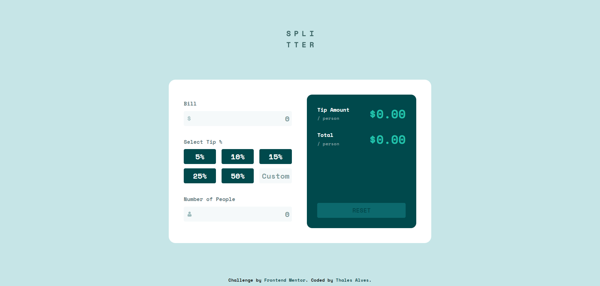

# Frontend Mentor - Tip calculator app

This is a solution to the [Tip calculator app challenge on Frontend Mentor](https://www.frontendmentor.io/challenges/tip-calculator-app-ugJNGbJUX). Frontend Mentor challenges help you improve your coding skills by building realistic projects.

## Table of contents

- [Overview](#overview)
  - [The challenge](#the-challenge)
  - [Screenshot](#screenshot)
    - [Desktop Layout](#desktop-layout)
    - [Mobile Layout](#mobile-layout)
  - [Links](#links)
- [My process](#my-process)
  - [Built with](#built-with)
- [Author](#author)

## Overview

### The challenge

Users should be able to:

- View the optimal layout for the app depending on their device's screen size
- See hover states for all interactive elements on the page
- Calculate the correct tip and total cost of the bill per person

### Screenshot

#### Desktop Layout

#### Mobile Layout

### Links

- Live Site URL: [Tip Calculator App](https://tip-calculator-app-main-beta-two.vercel.app/)

## My process

### Built with

- CSS Custom properties
- Flexbox

## Author

- Frontend Mentor - [@thalesAlves758](https://www.frontendmentor.io/profile/thalesAlves758)
- GitHub - [@thalesAlves758](https://github.com/thalesAlves758)
