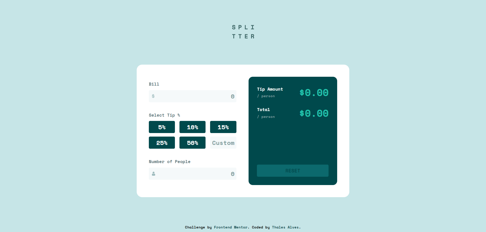
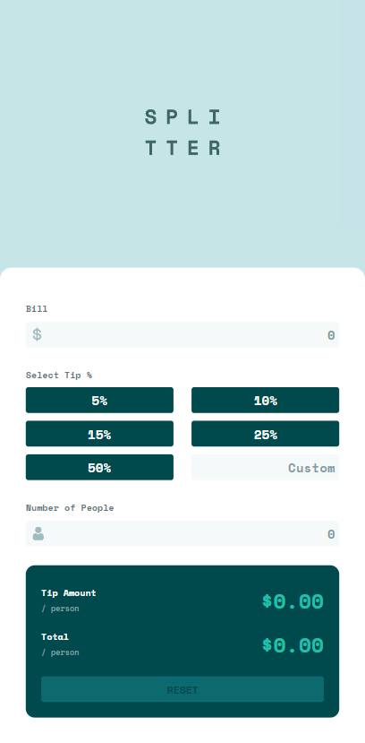

# Frontend Mentor - Calculadora de gorjeta

Esta é uma solução para o desafio [Tip calculator app no Frontend Mentor](https://www.frontendmentor.io/challenges/tip-calculator-app-ugJNGbJUX). Os desafios do Frontend Mentor ajudam você a melhorar suas habilidades de codificação, construindo projetos realistas.

## Índice

- [Visão Geral](#visão-geral)
    - [O desafio](#o-desafio)
    - [Captura de tela](#captura-de-tela)
        - [Desktop Layout](#desktop-layout)
        - [Mobile Layout](#mobile-layout)
    - [Links](#links)
- [Meu processo](#meu-processo)
    - [Construído com](#construído-com)
- [Autor](#autor)

## Visão Geral

### O desafio

Os usuários devem ser capazes de:

- Visualizar o layout ideal, dependendo do tamanho da tela do dispositivo
- Ver os estados de foco e hover para elementos interativos
- Calcular a gorjeta correta e o valor total da conta por pessoa

### Captura de tela

#### Desktop Layout

#### Mobile Layout

### Links

- URL do site ao vivo: [Tip Calculator App](https://tip-calculator-app-main-beta-two.vercel.app/)

## Meu processo

### Construído com

- CSS Custom properties
- Flexbox

## Autor

- Frontend Mentor - [@thalesAlves758](https://www.frontendmentor.io/profile/thalesAlves758)
- GitHub - [@thalesAlves758](https://github.com/thalesAlves758)
